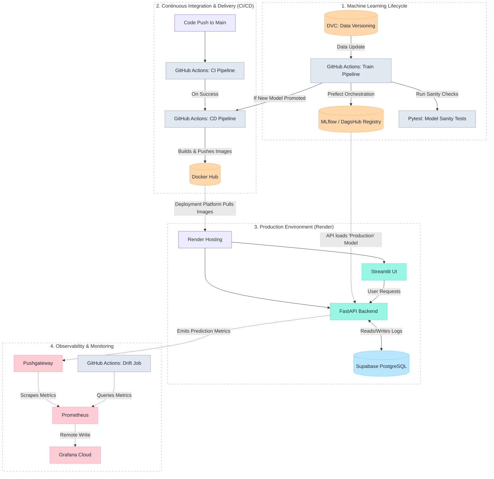

# MLOps End-to-End System

A comprehensive, production-ready MLOps project that handles data versioning, model orchestration, tracking, monitoring, and automated deployments via CI/CD.

---

## Live Demos

Check out the active deployment for each component of the ecosystem:

- 🎨 **Frontend (Streamlit)**: [https://mlops-frontend-latest-3fpd.onrender.com/](https://mlops-frontend-latest-3fpd.onrender.com/)
- ⚡ **API Service (FastAPI)**: [https://mlops-api-latest.onrender.com/](https://mlops-api-latest.onrender.com/)
- 📈 **Prometheus Metrics**: [https://mlops-prometheus-npxn.onrender.com/](https://mlops-prometheus-npxn.onrender.com/)
- 📥 **Pushgateway**: [https://mlops-pushgateway.onrender.com/](https://mlops-pushgateway.onrender.com/)

---

## 🏗 Architecture

The system follows a microservices architecture that separates the machine learning lifecycle from deployment and monitoring. It utilizes DagsHub for data and model tracking, and GitHub Actions to automate training, testing, and Docker image deployment.



---

## 🛠 Technologies Used

- **Web Frameworks**: FastAPI, Streamlit
- **ML & Data Management**: Prefect (Orchestration), MLflow (Experiment Tracking & Registry), DVC, DagsHub, Scikit-learn, XGBoost
- **Observability & Monitoring**: Prometheus, Pushgateway, Grafana Cloud
- **DevOps & Deployment**: Docker, Docker Compose, GitHub Actions
- **Database**: PostgreSQL (Supabase)

---

## 🐳 Docker Images

All custom services in this project are automatically built and pushed to Docker Hub via the CD pipeline. You can pull them directly:

- **Frontend**: `rakibullahboom/mlops-frontend:latest`
- **API**: `rakibullahboom/mlops-api:latest`
- **Prometheus**: `rakibullahboom/mlops-prometheus:latest`
- **Pushgateway**: Uses the official `prom/pushgateway:v1.6.2` image.

---

## 📂 Project Structure

```text
mlops-project/
├── .github/workflows/   # CI/CD pipelines (ci, cd, train, drift)
├── app/                 # Streamlit frontend application
├── src/                 # Main source code
│   ├── common/          # Shared utilities and helpers
│   ├── db/              # Database models and connections
│   ├── features/        # Feature engineering & preprocessing
│   ├── monitoring/      # Prometheus integration & Drift scripts
│   ├── serving/         # FastAPI application (main.py, config.py)
│   └── training/        # Prefect flow (flow.py) & model training
├── tests/               # Pytest suite & Model sanity checks
├── data/                # Dataset folder (tracked by DVC)
├── docker-compose.yml   # Multi-container orchestration
├── Dockerfile           # Multi-stage Dockerfile for API & Frontend
├── Dockerfile.prometheus# Custom Prometheus configuration
└── requirements-*.txt   # Environment dependencies
```

---

## ⚙️ Environment Variables (`.env`)

Before running the project locally or via Docker Compose, you must create a `.env` file at the root of the project. Different services rely on specific variables.

> **Important**: Never commit your actual `.env` file containing secrets to version control.

### Required Variables by Service

**API & Frontend (`api`, `frontend`)**
```ini
ALLOWED_ORIGINS="*"
MODEL_ALIAS="Production"
DATABASE_URL="postgresql://<user>:<password>@<host>:<port>/<db>"
```

**Data & Tracking (DVC & MLflow/DagsHub integration)**
```ini
DAGSHUB_USER="your-dagshub-user"
DAGSHUB_REPO="your-dagshub-repo"
DAGSHUB_TOKEN="your-dagshub-token"
```

**Monitoring (`prometheus`, `pushgateway`)**
```ini
# For syncing metrics to Grafana Cloud
GRAFANA_CLOUD_URL="https://prometheus-prod...grafana.net/api/prom/push"
GRAFANA_CLOUD_USER="your-grafana-user-id"
GRAFANA_CLOUD_API_KEY="your-grafana-api-key"
```

**CI/CD (Required in GitHub Secrets, optionally local)**
```ini
DOCKERHUB_USERNAME="your-docker-username"
DOCKERHUB_TOKEN="your-docker-pat"
```

---

## 🚀 Local Setup & Installation

### Option 1: Using Docker Compose (Recommended)

The easiest way to spin up the entire ecosystem is using Docker Compose. It builds the frontend, API, Prometheus, and Pushgateway simultaneously.

1. Clone the repository:
   ```bash
   git clone <your-repo-url>
   cd mlops-project
   ```

2. Create your `.env` file as described in the section above.

3. Run docker-compose:
   ```bash
   docker-compose up --build -d
   ```

4. Access the services locally:
   - **Frontend**: http://localhost:8501
   - **API**: http://localhost:8000
   - **Prometheus**: http://localhost:9090
   - **Pushgateway**: http://localhost:9091

### Option 2: Manual Setup

1. **Create a Virtual Environment:**
   ```bash
   python -m venv .venv
   source .venv/bin/activate  # On Windows use: .venv\Scripts\activate
   ```

2. **Install Dependencies:**
   ```bash
   pip install -r requirements-train.txt
   pip install -r requirements-serve.txt
   ```

3. **Pull Data from DVC:**
   ```bash
   dvc pull
   ```

4. **Run Services Individually:**
   - **API**: `cd src/serving && uvicorn main:app --reload`
   - **Frontend**: `streamlit run app/streamlit_app.py`

---

## 🔄 CI/CD Workflows

This project utilizes highly automated GitHub Actions to manage the entire machine learning lifecycle:

1. **CI Pipeline (`ci.yml`)**: Triggered on push or PR to `main`. It installs dependencies and runs the Pytest suite to ensure code reliability.
2. **Training Pipeline (`train.yml`)**: Triggered on data (`*.dvc`) or `src/` changes, or via schedule. It pulls data, runs the Prefect training flow, evaluates models, executes sanity tests (`test_model_sanity.py`) against the MLflow registry, and dynamically promotes the best model to "Production".
3. **CD Pipeline (`cd.yml`)**: Acts as a gatekeeper. It waits for **both** the CI and Training pipelines to complete successfully before building the new Docker images and pushing them to Docker Hub.
4. **Drift Detection (`drift.yml`)**: Periodically checks for data or model drift by analyzing metrics queried from Prometheus and Grafana.

---

## 📊 Monitoring & Observability

Observability is a core component of this MLOps system.

- **FastAPI** generates inference logs, prediction distributions, and latency metrics.
- **Pushgateway** acts as an intermediary, receiving short-lived metrics from the training and batch processes.
- **Prometheus** scrapes the API and Pushgateway, storing time-series data.
- **Grafana Cloud** (configured via `.env`) connects to Prometheus to visualize these metrics on dashboards and setup alerting for data drift.

---
