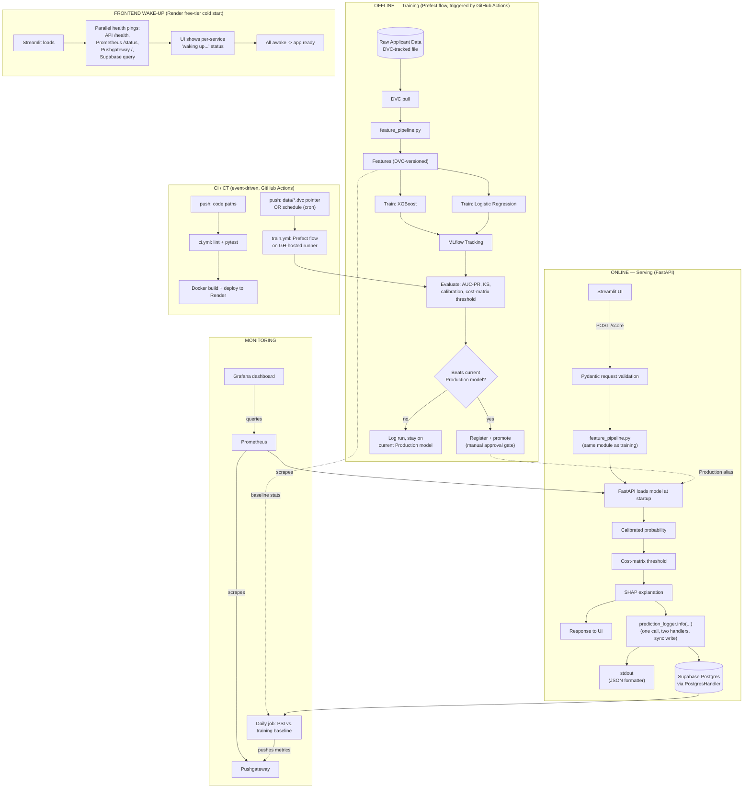

# Credit Risk Scoring System — Project Spec

## Part 1: Product Context & Requirements

### 1.1 Overview

- **Problem:** Predict probability of loan default at application time, convert that probability into an approve/reject decision using business-cost-driven thresholds, and serve that decision with an explanation — end to end, with production-grade monitoring and CI/CT.
- **Goal:** Demonstrate ML depth (leakage-safe evaluation, calibration, cost-sensitive decisioning) *through* a genuinely production-shaped system — not an ML notebook with a UI bolted on, and not an MLOps showcase with a trivial model inside it.
- **Why this project:** Structured/tabular prediction problems remain a distinct hiring lane from LLM/RAG "AI Engineer" roles. This project mirrors real work done by fintechs (e.g., B2B commerce platforms) rather than a generic Kaggle exercise.
- **Timeline:** 1–2 weeks, solo.

### 1.2 Out of Scope (Non-goals)

*(State this in the README so it reads as a decision, not a gap):*

- **No hyperparameter-search infra (Optuna/Ray Tune):** A small manual grid is enough.
- **No Kubernetes:** Docker + Render is proportional to this scale.
- **No feature store:** DVC-versioned features are sufficient.
- **No SMOTE/resampling:** Class weights are the more defensible choice here.

---

## Part 2: System Architecture

### 2.1 System Diagram



### 2.2 System Planes

| Plane | Runs when | Responsibility |
|---|---|---|
| Offline | On data/code push or schedule | Produce a versioned, evaluated, conditionally-promoted model |
| Online | Per user request | Turn a validated request into a calibrated, explained decision |
| Monitoring | Continuous / daily | Detect service failures and input drift independently |
| CI/CT | On push / schedule | Gate every code and model change behind tests and promotion checks |

### 2.3 Repository Structure

```text
credit-risk-scoring/
├── .github/workflows/
│   ├── ci.yml
│   └── train.yml
├── src/
│   ├── common/{logging_config.py, postgres_handler.py}
│   ├── features/feature_pipeline.py
│   ├── training/{train.py, evaluate.py, flow.py}
│   ├── serving/{main.py, schemas.py, config.py, middleware.py}
│   ├── monitoring/drift_job.py
│   └── db/models.py                 # prediction_logs table only
├── app/streamlit_app.py
├── config/{training_config.yaml, serving_config.yaml}
├── tests/{test_features.py, test_api_contract.py, test_model_sanity.py}
├── data/dataset.csv.dvc      # pointer only, not raw data
├── Dockerfile
├── docker-compose.yml               # local Postgres (prediction_logs only) + API + Streamlit
├── dvc.yaml
├── requirements.txt
└── README.md
```

---

## Part 3: Data & Offline ML Pipeline

### 3.1 Dataset & Feature Engineering

- **Source:** LendingClub Loan Data (Kaggle), filtered to 2016–2018 issuance (~500K rows).
- **Target:** `loan_status` collapsed to binary — Fully Paid (0) vs. Charged Off (1). Drop pending outcomes.
- **Split Strategy:** Temporal (using `issue_d`), not random, to prevent future information leakage.
- **Leakage Removal:** Explicitly drop `total_pymnt`, `recoveries`, `last_pymnt_amnt`, `collection_recovery_fee`. Document this as a leakage check in the README.
- **Data Tracking (DVC):**  dataset is tracked via DVC (DagsHub s3 bucket remote). No Postgres for training data. "New data" event = `dvc push` + `git commit` of `.dvc` file.

### 3.2 Modeling & Evaluation

- **Baseline:** Logistic Regression (`class_weight='balanced'`).
- **Challenger:** XGBoost (small manual grid: depth, learning rate, n_estimators).
- **Calibration:** `CalibratedClassifierCV` (Platt or isotonic) applied to the winning model.
- **Decision Threshold:** Swept against a cost matrix (FN cost ≫ FP cost) stored in config. Pick the threshold minimizing expected cost.
- **MLflow Tracking:** One experiment (`credit-risk-scoring`), one run per training invocation. Log AUC-PR, KS statistic, expected cost, calibration curve plot.
- **Model Registry:** Register the winning run using aliases (`Staging`, `Production`). Promotion is conditional on beating current Production expected cost.

### 3.3 Training Orchestration (Prefect)

- **Tasks:** `load_data` → `build_features` → `train_lr` / `train_xgboost` (parallel) → `evaluate` → `compare_to_production` → `register_and_promote`.
- **Execution:** Runs entirely inside GitHub Actions, not a standalone worker. Retries/caching at task level; UI visibility maintained via Prefect Cloud.

---

## Part 4: Online Serving & Infrastructure

### 4.1 Serving API (FastAPI)

Loads Production aliased model at startup.

| Endpoint | Method | Purpose |
|---|---|---|
| `/score` | POST | Validate → feature pipeline → predict → calibrate → threshold → SHAP → log → respond |
| `/health` | GET | Liveness check |
| `/metrics` | GET | Prometheus scrape target |

### 4.2 Configuration Strategy

Strict three-way separation:

1. **Static config** (`training_config.yaml`): hyperparams, features, split date, cost-matrix. (Loaded via Pydantic `BaseModel`).
2. **Secrets** (`.env`): DB URL, MLflow tracking URI, DVC remote. (Loaded via Pydantic `BaseSettings`).
3. **Per-request data** (HTTP body): applicant specs. (Loaded via Pydantic `BaseModel` request schema).

### 4.3 Unified Logging & Database (Supabase Postgres)

- Database is **Supabase Postgres** (managed, hosted). Only one table exists: `prediction_logs(id, ts, request_json, probability, decision, model_version, latency_ms)`.
- **Central Setup:** `logging_config.py` uses `python-json-logger` for structured JSON logs across the application.
- **One Call, Two Handlers:** A dedicated `prediction_logger` handles predictions. A single `.info()` call fans out to:
  - `StreamHandler`: stdout (JSON) for operational tracing.
  - `PostgresHandler`: Custom handler inserting a row into `prediction_logs`.
- **Write mode: synchronous (non-blocking write removed).** `PostgresHandler` writes inline on the request thread — no `QueueHandler`/`QueueListener`. Simpler, accepted tradeoff: a slow/unavailable DB will slow or fail the `/score` request. Documented in README as a deliberate simplicity-over-throughput choice.
- **Request Correlation:** FastAPI middleware injects a UUID4 `request_id` into a `contextvars.ContextVar`, applied to all logs via a `logging.Filter`.

---

## Part 5: DevOps, CI/CT & Monitoring

### 5.1 Testing Strategy (pytest)

- **Unit:** `feature_pipeline.py` (nulls, known IO, boundaries).
- **Contract:** FastAPI endpoints (422 rejections, valid schema returns).
- **Model sanity:** Monotonicity spot-checks, bounds checking.

### 5.2 GitHub Actions (CI/CT)

- **`ci.yml`:** Runs on push. Lints, tests, builds Docker image, and deploys to Render.
- **`train.yml`:** Runs on path filters (`src/**`, `data/*.dvc`) or cron schedule. Executes the Prefect flow.
- **Promotion Gate:** `register_and_promote` step requires a manual approval click via GitHub Environment Protection rules before changing the Production alias.

### 5.3 Monitoring & Drift

- **Service Health:** Prometheus scrapes `/metrics` (latency, error rate).
- **Drift Job:** Daily scheduled job reads `prediction_logs`, computes PSI against DVC training baseline, pushes to Prometheus Pushgateway.
- **Drift Job Wake-Up:** Since this job runs on its own GitHub Actions cron schedule (not triggered by the frontend), it cannot rely on the frontend's wake-up step. At the start of `drift_job.py`, it pings Pushgateway's and Prometheus's health/root endpoints, retrying with a short backoff (e.g., every 5s, up to ~60-90s total) until both respond, before computing PSI and pushing metrics. This avoids the actual metrics push failing against a cold (sleeping) Pushgateway.
- **Dashboard:** Single Grafana dashboard showing both service health and data PSI.

### 5.4 Deployment Topology & Wake-Up Handling (Render free tier)

- **Services on Render:** FastAPI (API), Streamlit (frontend), Prometheus — each deployed as separate dockerized services on Render's public network. Database is Supabase Postgres (external, managed).
- **Access control:** Each service only accepts requests from origins listed in its own `.env` (allow-list of URLs). Note: this is a browser-facing CORS safeguard only — server-to-server calls (API → Supabase, Prometheus → API `/metrics`) still require their own auth (Supabase connection key; API key or IP-restriction on `/metrics`).
- **Free-tier cold starts:** Render free services sleep independently after ~15 min idle; Supabase pauses only after longer full inactivity, with a separate (and possibly slower) wake time — do not assume it behaves like Render's per-service sleep.
- **Wake-up flow:** On load, Streamlit fires health checks to the API, Prometheus, Pushgateway, and Supabase **in parallel** (not sequentially, to avoid summing cold-start times). Pushgateway is passive and has no keep-alive of its own — it only stays awake if it receives traffic, so it must be included in this same ping list (there is no other mechanism to wake it). While waking, the UI shows a per-service "waking up..." status; once all four respond, the app becomes usable.

---

## Part 6: Project Management

### 6.1 Phased Implementation Plan

- **Days 1–3:** EDA, leakage check/removal, temporal split, baseline LR + XGBoost, calibration, cost-matrix threshold, SHAP.
- **Days 4–6:** `feature_pipeline.py` shared module; DVC + MLflow wired into Prefect flow.
- **Days 7–9:** FastAPI + Pydantic + pytest + `prediction_logger` (stdout + queued PostgresHandler) + request correlation middleware.
- **Days 9–11:** Streamlit UI.
- **Days 11–12:** Dockerize, GitHub Actions CI/CT with promotion gate, Render deploy.
- **Days 13–14:** Prometheus/Grafana drift dashboard, README system design write-up. *(Fallback priority: Cut Grafana first, promotion-gate automation second.)*

### 6.2 Definition of Done

- [ ] Temporal split + leakage columns documented in README.
- [ ] LR + XGBoost logged and comparable in MLflow.
- [ ] Calibrated probabilities + cost-matrix threshold implemented.
- [ ] `feature_pipeline.py` imported by both training and serving code.
- [ ] `/score` returns probability, decision, and SHAP.
- [ ] Structured JSON logs with per-request correlation ID.
- [ ] `prediction_logs` populated via PostgresHandler (synchronous write, no separate DB-insert path).
- [ ] Frontend wake-up flow pings API, Prometheus, Pushgateway, and Supabase in parallel with per-service status shown to the user.
- [ ] All 3 pytest tiers passing in CI.
- [ ] `train.yml` fires on data/code paths and schedule.
- [ ] Promotion requires new model to beat Production model.
- [ ] Grafana dashboard shows service health and PSI drift.
- [ ] `drift_job.py` pings and waits for Pushgateway and Prometheus to be awake before pushing PSI metrics.
- [ ] Deployed and reachable on Render.
